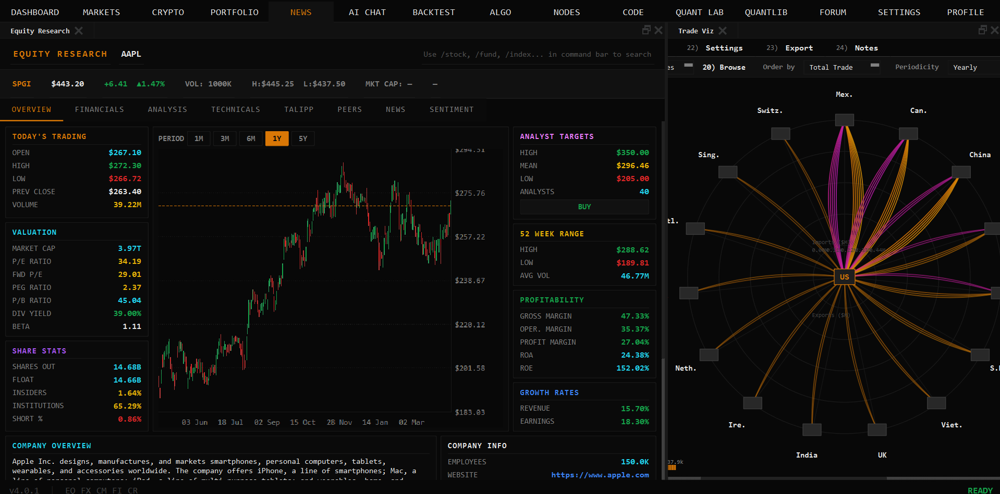
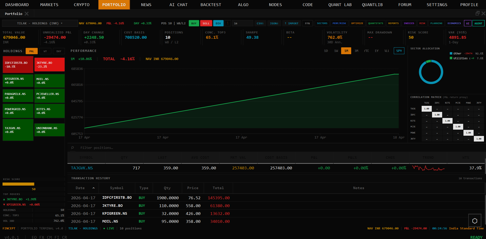
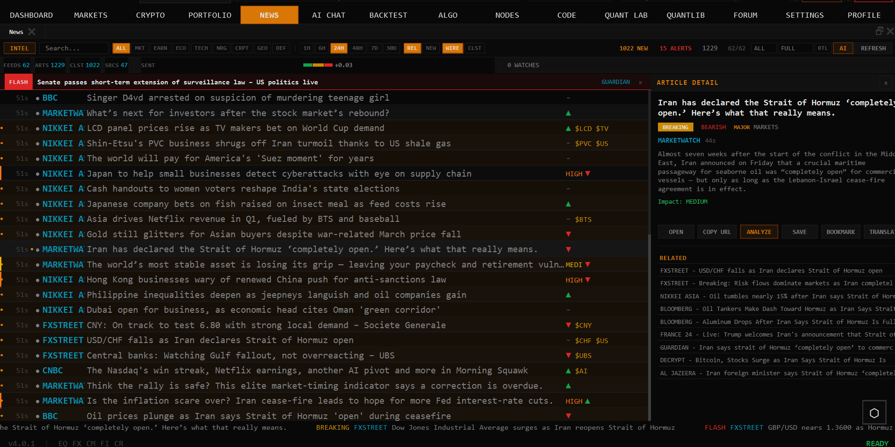
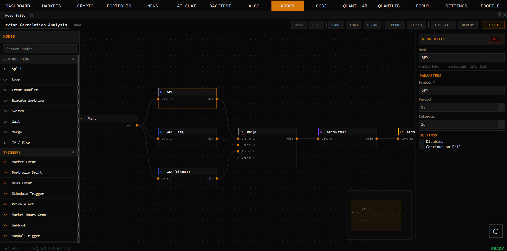

# Cherry Terminal

<div align="center">

### **Your Thinking is the Only Limit. The Data Isn't.**

Native C++20 financial intelligence platform — institutional-grade analytics, real-time trading, and 100+ data connectors in a single binary.


<table>
  <tr>
    <td align="center" width="25%"><br/><sub><b>Equity Research</b></sub></td>
    <td align="center" width="25%"><br/><sub><b>Portfolio</b></sub></td>
    <td align="center" width="25%"><br/><sub><b>News</b></sub></td>
    <td align="center" width="25%"><br/><sub><b>Node Editor</b></sub></td>
  </tr>
</table>

</div>

---

## Why Native C++20

Most financial tools run on Electron or Python runtimes — they leak memory, struggle with real-time data, and add latency at every layer. Cherry Terminal compiles to a single native binary: no Node.js, no browser engine, no interpreter overhead. The UI runs in Qt6, analytics run in embedded Python, and everything performance-critical runs in C++20.

---

## Tech Stack

| Layer | Technology |
|-------|-----------|
| **Core** | C++20 (MSVC 19.38 / GCC 12.3 / Apple Clang 15) |
| **UI** | Qt6.8.3 — native rendering, no web runtime |
| **Analytics** | Embedded Python 3.11 via pybind11 |
| **Quant** | QuantLib — 18 quantitative analysis modules |
| **Build** | CMake 3.27 + Ninja |
| **Deployment** | Single native binary, Windows / Linux / macOS |

---

## Features

### Quantitative Finance
18 QuantLib modules covering pricing, risk, stochastic processes, volatility surfaces, and fixed income. Runs natively — no JVM, no Python subprocess overhead.

- Derivatives pricing (Black-Scholes, Heston, SABR)
- Fixed income (yield curves, bond pricing, duration/convexity)
- Risk metrics: VaR, CVaR, Sharpe, Sortino, max drawdown
- Portfolio optimization (mean-variance, Black-Litterman)
- Monte Carlo simulation with variance reduction

### Real-Time Trading
- **16 broker integrations**: IBKR, Alpaca, Tradier, Saxo, Zerodha, Angel One, Upstox, Fyers, Dhan, Groww, Kotak, IIFL, 5paisa, AliceBlue, Shoonya, Motilal
- WebSocket streams for crypto (Kraken, HyperLiquid) and equity
- Paper trading engine for strategy testing
- Algo trading with order management

### Data Connectivity
100+ sources including DBnomics, Polygon, Kraken, Yahoo Finance, FRED, IMF, World Bank, AkShare, government APIs, and alternative data overlays (Adanos market sentiment).

### AI Agents
37 agents across Trader/Investor (Buffett, Graham, Lynch, Munger, Klarman, Marks), Economic, and Geopolitics frameworks. Supports local LLMs and 8 cloud providers (OpenAI, Anthropic, Gemini, Groq, DeepSeek, MiniMax, OpenRouter, Ollama).

### Visual Workflows
Node editor for automation pipelines, MCP tool integration, and AI Quant Lab (ML models, factor discovery, HFT strategies, RL-based trading).

---

## Installation

### Option 1 — One-Click Build

```bash
# Linux / macOS
git clone https://github.com/Dropio12/CherryTerminal.git
cd CherryTerminal
chmod +x setup.sh && ./setup.sh
```

Handles: compiler check, CMake, Qt6, Python, build, and launch automatically.

> **Windows:** Use Option 3 (manual build) — two commands.

---

### Option 2 — Docker (CI / Dev Environments)

> Docker is for CI/CD and development only. For the full experience, use Option 1 or 3.
> Requires Linux with X11. Windows and macOS not supported.

```bash
git clone https://github.com/Dropio12/CherryTerminal.git
cd CherryTerminal
docker build -t cherry-terminal .
docker run --rm -e DISPLAY=$DISPLAY -v /tmp/.X11-unix:/tmp/.X11-unix cherry-terminal
```

---

### Option 3 — Build from Source

> **Versions are pinned.** Use exact versions below — newer or older may fail.

#### Prerequisites

| Tool | Version | Notes |
|------|---------|-------|
| **Git** | latest | — |
| **CMake** | **3.27.7** | [Download](https://cmake.org/download/) |
| **Ninja** | **1.11.1** | [Download](https://github.com/ninja-build/ninja/releases) |
| **C++ compiler** | **MSVC 19.38** / **GCC 12.3** / **Apple Clang 15.0** | C++20 required |
| **Qt** | **6.8.3** | [Qt Installer](https://www.qt.io/download-qt-installer) |
| **Python** | **3.11.9** | [python.org](https://www.python.org/downloads/release/python-3119/) |

#### Build (CMake presets — recommended)

```bash
git clone https://github.com/Dropio12/CherryTerminal.git
cd CherryTerminal/fincept-qt

# Step 1 — Configure (once, or after CMakeLists.txt changes)
cmake --preset win-release      # Windows
cmake --preset linux-release    # Linux
cmake --preset macos-release    # macOS

# Step 2 — Compile
cmake --build --preset win-release      # Windows
cmake --build --preset linux-release    # Linux
cmake --build --preset macos-release    # macOS
```

#### Build (manual — if presets can't resolve your Qt path)

```powershell
# Windows
cmake -B build/win-release -G Ninja -DCMAKE_BUILD_TYPE=Release `
  -DCMAKE_PREFIX_PATH="C:/Qt/6.8.3/msvc2022_64"
cmake --build build/win-release
```

```bash
# Linux
cmake -B build/linux-release -G Ninja -DCMAKE_BUILD_TYPE=Release \
  -DCMAKE_PREFIX_PATH="$HOME/Qt/6.8.3/gcc_64"
cmake --build build/linux-release

# macOS
cmake -B build/macos-release -G Ninja -DCMAKE_BUILD_TYPE=Release \
  -DCMAKE_OSX_DEPLOYMENT_TARGET=11.0 \
  -DCMAKE_PREFIX_PATH="$HOME/Qt/6.8.3/macos"
cmake --build build/macos-release
```

#### Run

```bash
./build/<preset>/Cherry-Terminal        # Linux / macOS
.\build\<preset>\Cherry-Terminal.exe    # Windows
```

#### Troubleshooting

1. **"Could not find Qt6 6.8.3"** — verify `CMAKE_PREFIX_PATH` points to Qt 6.8.3, not 6.5/6.6/6.8.
2. **MSVC version error** — use VS 2022 17.8+ (MSVC 19.38+). Check with `cl /?`.
3. **Different Qt minor needed?** Pass `-DFINCEPT_ALLOW_QT_DRIFT=ON` (local testing only).
4. **Clean rebuild** — delete `build/<preset>/` and re-run configure.

---

## Roadmap

| Timeline | Milestone |
|----------|-----------|
| **Shipped** | Real-time streaming, 16 broker integrations, multi-account trading, PIN auth, theme system |
| **Q2 2026** | Options strategy builder, multi-portfolio management, 50+ AI agents |
| **Q3 2026** | Programmatic API, ML training UI, institutional features |
| **Future** | Mobile companion, cloud sync, community marketplace |

---

## License

AGPL-3.0 for personal and academic use. Commercial license available for business applications.
